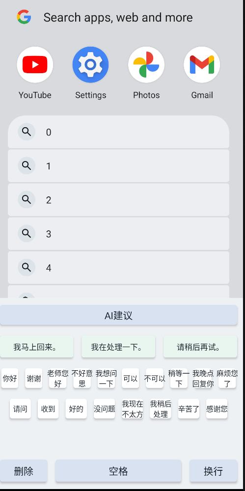
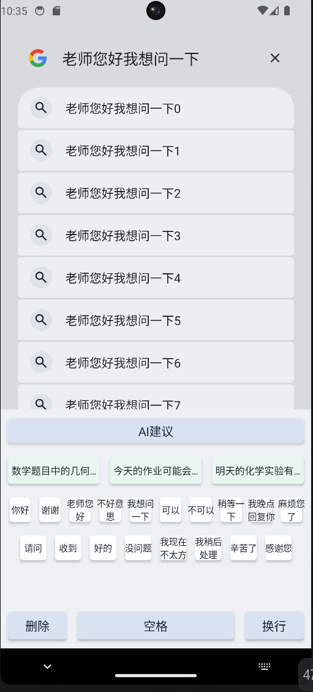
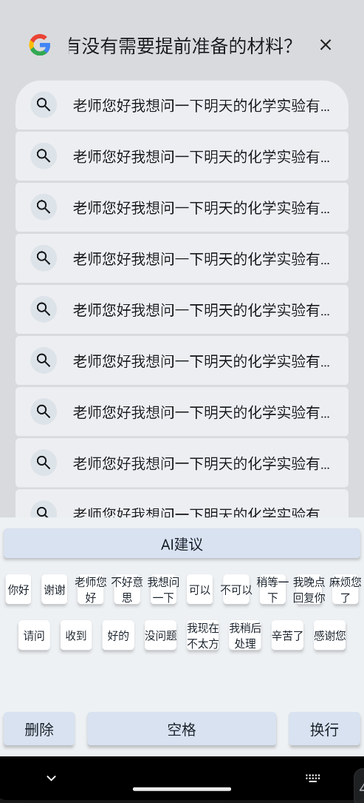

# AI Input Method MVP

> A Kotlin-based Android Input Method MVP that combines Chinese quick replies with AI-powered continuation suggestions.

> 一个基于 Kotlin 的 Android 输入法 MVP，结合中文快捷回复按钮与 AI 续写候选句能力。

## 项目简介 / Overview

**AI Input Method MVP** 是一个 Android 原生输入法实验项目。它不尝试实现完整拼音输入法，而是聚焦于一个更轻量、可落地的场景：在聊天、学习、办公和师生沟通中，通过中文快捷按钮和 AI 续写候选句提升回复效率。

The project is a native Android input method built around `InputMethodService`. Instead of implementing a full Pinyin IME, it focuses on a practical workflow: Chinese quick-reply buttons plus AI-generated continuation suggestions for everyday messaging and communication.

## 截图 / Screenshots

截图建议放在以下目录：

Recommended screenshot location:

```text
docs/screenshots/
```

建议截图内容：

- 输入法启用页面
- 中文快捷回复键盘
- 点击 `AI建议` 后的 `生成中...` 状态
- 3 条 AI 候选句展示区
- 在微信、浏览器或备忘录中插入候选句的效果

Suggested screenshots:

- IME enable/settings screen
- Chinese quick-reply keyboard
- `Generating...` state after tapping the AI button
- Three AI suggestion candidates
- Candidate insertion in WeChat, browser, or notes apps

## 功能列表 / Features

- Android 系统输入法注册与启用
- 基于 `InputMethodService` 的原生 IME 实现
- 中文快捷回复按钮面板
- AI 建议按钮
- 3 条候选句展示区
- 空格、删除、换行基础功能键
- 通过 `getTextBeforeCursor(200, 0)` 获取光标前上下文
- 使用 OpenRouter API 获取真实 AI 候选句
- 请求期间显示 `生成中...`
- 防重复点击与 2 秒请求节流
- API 失败时返回本地 fallback 候选句
- 候选句插入时避免重复已有输入前缀
- API Key 通过 `local.properties` 注入，不硬编码在源码中

English:

- Registers as an Android system input method
- Native IME implementation using `InputMethodService`
- Chinese quick-reply button panel
- AI suggestion button
- Three suggestion candidates
- Space, delete, and newline keys
- Reads context with `getTextBeforeCursor(200, 0)` only when requested
- Calls OpenRouter API for real AI suggestions
- Shows a loading state during generation
- Prevents repeated rapid requests with throttling
- Falls back to local mock suggestions on API failure
- Avoids duplicated prefix insertion
- Keeps the API key outside source code via `local.properties`

## 技术架构 / Technical Architecture

```text
Android Input Field
        |
        v
AiInputMethodService
        |
        |-- Chinese quick-reply buttons
        |-- Space / Delete / Newline actions
        |-- AI suggestion trigger
        |
        v
AiClient
        |
        |-- OkHttp POST request
        |-- OpenRouter Chat Completions API
        |-- JSON response parsing
        |-- fallback suggestions
```

核心技术栈：

- Kotlin
- Android native Views
- `InputMethodService`
- Kotlin Coroutines
- OkHttp
- OpenRouter API
- `org.json` JSON parsing
- Gradle `BuildConfig` API key injection

Core stack:

- Kotlin
- Android native Views
- `InputMethodService`
- Kotlin Coroutines
- OkHttp
- OpenRouter API
- `org.json` JSON parsing
- Gradle `BuildConfig` API key injection

## AI 调用流程 / AI Request Flow

中文流程：

1. 用户在任意输入框中输入内容。
2. 用户点击输入法顶部的 `AI建议` 按钮。
3. 输入法通过 `getTextBeforeCursor(200, 0)` 读取光标前最多 200 个字符。
4. `AiInputMethodService` 显示 `生成中...`，并启动协程。
5. `AiClient` 在 `Dispatchers.IO` 中通过 OkHttp 调用 OpenRouter API。
6. 模型返回 JSON 数组格式的 3 条续写候选句。
7. 客户端解析 `choices[0].message.content`。
8. 解析成功则展示候选句；失败则展示 fallback 候选句。
9. 用户点击候选句后，输入法通过 `commitText` 插入文本。

English flow:

1. The user types text in any input field.
2. The user taps the `AI建议` button.
3. The IME reads up to 200 characters before the cursor with `getTextBeforeCursor(200, 0)`.
4. `AiInputMethodService` shows a loading state and starts a coroutine.
5. `AiClient` calls OpenRouter API with OkHttp on `Dispatchers.IO`.
6. The model returns three continuation suggestions as a JSON array.
7. The client parses `choices[0].message.content`.
8. Parsed suggestions are shown; fallback suggestions are used on failure.
9. The selected candidate is inserted with `commitText`.

## 输入法权限说明 / IME Permissions

本项目需要注册为系统输入法，因此 `InputMethodService` 使用：

```xml
android.permission.BIND_INPUT_METHOD
```

这是 Android 系统对输入法服务的标准要求。

项目还需要网络权限用于请求 OpenRouter API：

```xml
<uses-permission android:name="android.permission.INTERNET" />
```

隐私边界：

- 不在普通按键输入时读取上下文。
- 只有用户主动点击 `AI建议` 时，才读取光标前最多 200 个字符。
- API Key 不写在源码中，而是通过本地配置注入。

Privacy boundary:

- The IME does not read context during normal key input.
- Context is read only when the user taps the AI suggestion button.
- At most 200 characters before the cursor are used.
- The API key is not hardcoded in source files.

## 如何运行项目 / How to Run

1. 使用 Android Studio 打开项目根目录。
2. 等待 Gradle Sync 完成。
3. 配置 OpenRouter API Key，见下一节。
4. 连接 Android 真机并开启 USB 调试。
5. 选择 `app` 配置并点击 Run。
6. 安装后进入系统输入法设置，启用 `AI输入法 MVP`。
7. 在任意输入框中切换到该输入法进行测试。

English:

1. Open the project root directory in Android Studio.
2. Wait for Gradle Sync to finish.
3. Configure the OpenRouter API key as described below.
4. Connect a real Android device with USB debugging enabled.
5. Select the `app` configuration and run it.
6. Enable `AI输入法 MVP` in system input method settings.
7. Switch to this IME in any input field and test it.

Command-line build:

```powershell
.\gradlew.bat assembleDebug
```

## 配置 OpenRouter API Key / OpenRouter API Key

在项目根目录的 `local.properties` 中添加：

Add the following line to `local.properties` in the project root:

```properties
OPENROUTER_API_KEY=your_openrouter_api_key
```

Gradle 会把该值注入到：

Gradle injects this value into:

```kotlin
BuildConfig.OPENROUTER_API_KEY
```

注意：

- 不要把真实 API Key 提交到 GitHub。
- 建议将 `local.properties` 保持在 `.gitignore` 中。
- 如果 Key 为空，项目会直接使用本地 fallback 候选句，不会发起网络请求。

Notes:

- Do not commit a real API key to GitHub.
- Keep `local.properties` ignored by version control.
- If the key is empty, the app uses local fallback suggestions without making a network request.

## 项目目录结构 / Project Structure

```text
.
├── app/
│   ├── build.gradle.kts
│   └── src/main/
│       ├── AndroidManifest.xml
│       ├── java/com/example/aiime/
│       │   ├── AiClient.kt
│       │   ├── AiInputMethodService.kt
│       │   └── MainActivity.kt
│       └── res/
│           ├── layout/ime_keyboard.xml
│           ├── xml/method.xml
│           └── values/
├── build.gradle.kts
├── settings.gradle.kts
├── local.properties
└── README.md
```

关键文件：

- `AiInputMethodService.kt`: 输入法主逻辑、快捷回复按钮、候选句插入、防重复请求
- `AiClient.kt`: OpenRouter 请求、JSON 解析、fallback 候选句
- `ime_keyboard.xml`: 输入法界面布局
- `method.xml`: Android IME 元信息配置
- `local.properties`: 本地 SDK 与 API Key 配置

Key files:

- `AiInputMethodService.kt`: IME logic, quick replies, candidate insertion, throttling
- `AiClient.kt`: OpenRouter request, JSON parsing, fallback suggestions
- `ime_keyboard.xml`: IME layout
- `method.xml`: Android IME metadata
- `local.properties`: local SDK and API key configuration

## 未来可扩展方向 / Future Work

- 支持更多中文快捷回复分类，例如学习、办公、客服、社交
- 增加语气选择：正式、礼貌、简短、轻松
- 支持用户自定义快捷短语
- 支持候选句历史与收藏
- 增加更细粒度的隐私控制
- 支持多模型切换
- 支持流式生成与更快的候选展示
- 增加单元测试和端到端输入法交互测试
- 优化横屏和不同屏幕尺寸布局

English:

- Add more quick-reply categories, such as study, work, customer support, and social messaging
- Add tone controls: formal, polite, concise, casual
- Support user-defined quick phrases
- Add suggestion history and favorites
- Add more privacy controls
- Support multiple AI models
- Add streaming generation
- Add unit tests and end-to-end IME interaction tests
- Improve landscape and multi-screen layout support

## 简历描述示例 / Resume Description

中文：

> 设计并实现了一个 Android AI 输入法 MVP，基于 Kotlin 和 `InputMethodService` 构建原生输入法服务，支持中文快捷回复、AI 续写候选句、OpenRouter API 调用、协程异步请求、OkHttp 网络层、JSON 解析、API Key 本地注入和候选句去重插入。项目可在真机启用为系统输入法，并完成完整 Build/Run 验证。

English:

> Built an Android AI input method MVP using Kotlin and `InputMethodService`, featuring Chinese quick replies, AI-powered continuation suggestions, OpenRouter API integration, coroutine-based async requests, OkHttp networking, JSON parsing, local API key injection, and duplicate-prefix-safe candidate insertion. The project can be installed and enabled as a system IME on a real Android device.
## Screenshots

## Architecture

```text
Keyboard UI
↓
InputMethodService
↓
Coroutine async request
↓
OpenRouter API
↓
LLM suggestion JSON
↓
Candidate insertion logic
```

### Keyboard Layout



---

### AI Suggestions



---

### Insert Result


## License 建议 / License Recommendation

如果该项目用于作品集、面试或学习展示，建议使用 MIT License：

For portfolio, interview, or learning purposes, the MIT License is recommended:

```text
MIT License
```

如果后续包含商业模型、私有 prompt 或业务数据，建议在开源前重新评估 License 和 API Key 管理策略。

If the project later includes commercial models, private prompts, or business data, review the license and API key management strategy before open sourcing it.
